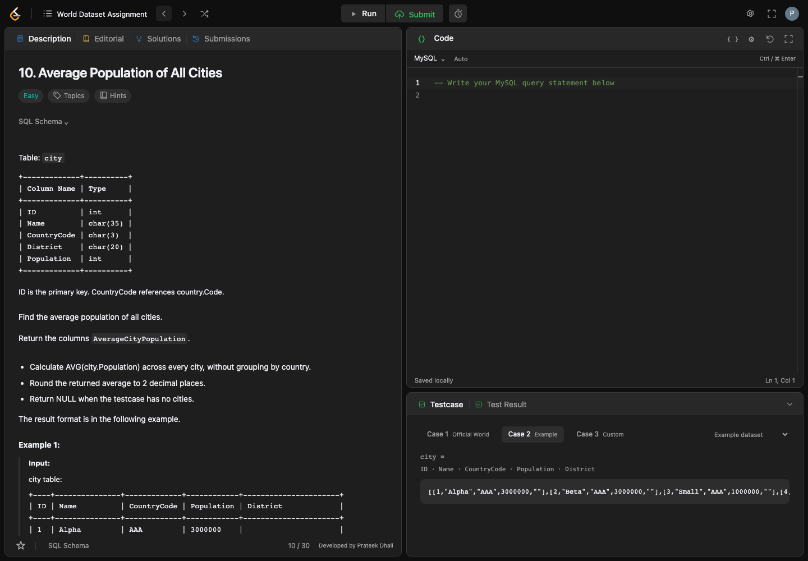
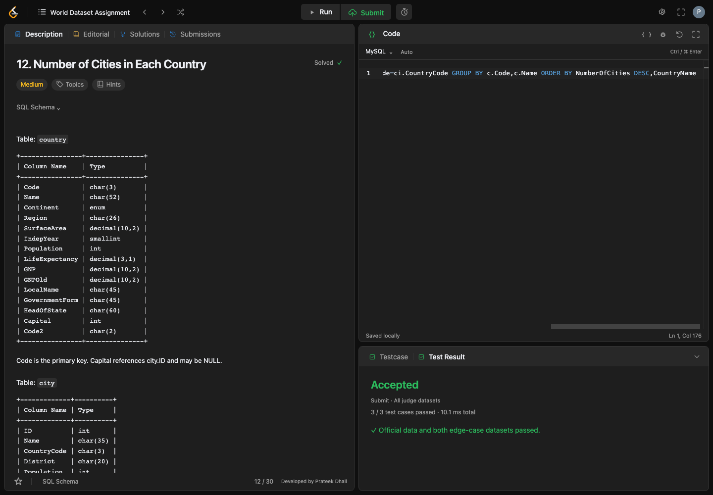
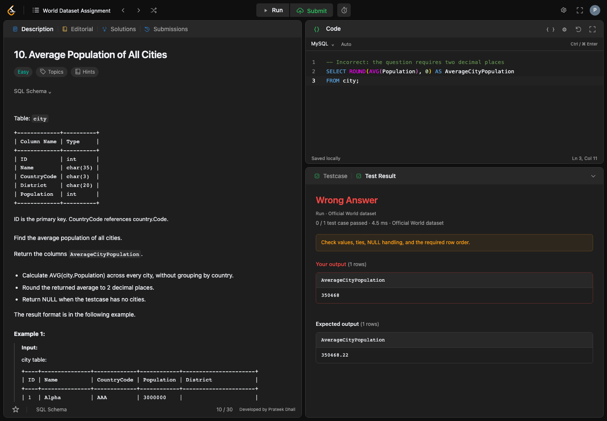
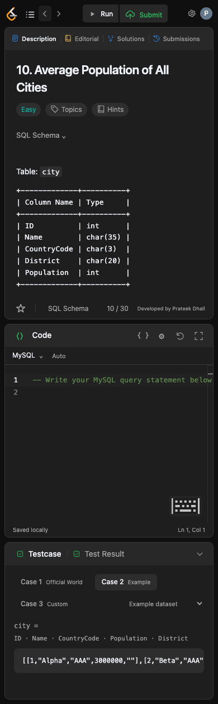

<div align="center">

# 🌍 World Dataset Assignment

**Write SQL. Run testcases. Build confidence.**

A LeetCode-inspired MySQL workspace with 30 assignment questions,
a dark editor, and instant answer validation.


[Quick start](#quick-start) · [Screenshots](#screenshots) · [Testing](#testing) · [Project structure](#project-structure)

</div>



## ✨ A familiar place to practice

- **30 questions · 3 difficulty levels** — browse Easy, Medium, and Hard exercises with schemas, examples, hints, and reference solutions.
- **A real MySQL editor** — Monaco with SQL completion, formatting, syntax highlighting, undo/redo, find/replace, and multiple cursors.
- **Clear feedback** — green Accepted or red Wrong Answer, with your output and expected output side by side.
- **Run and Submit** — try official, example, or custom inputs; submit against three judge datasets.
- **Your own workspace** — resizable panels, dark/light themes, favorites, a timer, saved drafts, and submission history.
- **Local by default** — Docker runs the app and MySQL on your machine. Editor assets are bundled locally.

> These are World Dataset assignment exercises, not LeetCode's official SQL 50 problems. Questions 1–10 follow the supplied assignment; 11–30 retain the app's clarified definitions. Each question documents its required columns, ordering, and rounding.

<a id="quick-start"></a>

## 🚀 Quick start

Use the guide for your operating system below. Run each command separately, in the order shown. Commands are intended for **Terminal on macOS** and **PowerShell on Windows**.

**Before you begin:**

- Install Docker Desktop using the instructions below.
- Keep an internet connection available for the first build.
- Leave ports **8080** and **3307** available.
- You do not need to install Python, Node.js, or MySQL separately. Docker installs and runs the application dependencies.

### 🍎 macOS — install and launch

**Step 1 · Install Docker Desktop**

Download [Docker Desktop for macOS](https://docs.docker.com/desktop/setup/install/mac-install/), choosing **Apple silicon** or **Intel** for your Mac. Open the `.dmg` file and drag Docker into Applications. Open Docker from Applications and complete the initial setup. Wait until its engine is running.

**Step 2 · Download and extract the application**

On this GitHub repository page, select **Code → Download ZIP**. Open your Downloads folder and double-click the ZIP. Rename the extracted project folder to **`world-sql-practice`** and leave it in Downloads.

Open that folder and check that `docker-compose.yml`, `Dockerfile`, `app`, and `mysql-init` are directly inside it. If you see another project folder instead, open that inner folder first.

**Step 3 · Open Terminal in the application folder**

Open **Terminal** from Applications → Utilities and run:

```sh
cd "$HOME/Downloads/world-sql-practice"
```

Check that the configuration file is present:

```sh
ls docker-compose.yml
```

Expected result: `docker-compose.yml`. If you saved the project elsewhere, type `cd `, drag its folder from Finder into Terminal, and press Enter instead.

**Step 4 · Verify Docker is ready**

```sh
docker compose version
```

Expected result: a Docker Compose version number.

```sh
docker info
```

Expected result: Docker client and server details, without a connection error. If it fails, open Docker Desktop and wait for the engine to start.

**Step 5 · Build and start the application**

```sh
docker compose up --build -d
```

Wait for this command to finish. The first launch downloads images, installs dependencies inside the container, and initializes the database. It may take several minutes. The `-d` option keeps the app running in the background.

**Step 6 · Check startup completed**

```sh
docker compose ps
```

Expected result: the `db` service shows **Up … (healthy)** and the `app` service shows **Up**. If the database is still starting, wait and run the command again.

Check the application and dataset:

```sh
curl --fail --silent --show-error http://localhost:8080/api/health
```

Expected result: JSON containing `"ok":true`, `"country":239`, `"city":4079`, and `"countrylanguage":984`.

**Step 7 · Open the application**

Open **[http://localhost:8080](http://localhost:8080)** in your browser. Choose a question from **World Dataset Assignment**, enter a query, and click **Run**. Use **Submit** to check all judge datasets.

### 🪟 Windows — install and launch

**Step 1 · Install Docker Desktop**

Follow the [Docker Desktop for Windows installation guide](https://docs.docker.com/desktop/setup/install/windows-install/). Use the **WSL 2 backend**. Complete any WSL installation or update requested by the installer and restart Windows if prompted. Open Docker Desktop from the Start menu, complete its initial setup, and wait until its engine is running. This application uses Linux containers.

**Step 2 · Download and extract the application**

On this GitHub repository page, select **Code → Download ZIP**. In File Explorer, right-click the downloaded ZIP and choose **Extract All**. Open the extracted project folder and check that `docker-compose.yml`, `Dockerfile`, `app`, and `mysql-init` are directly inside it. If you see another project folder instead, open that inner folder first.

**Step 3 · Open PowerShell in the application folder**

In File Explorer, while inside the project folder, click the address bar, type **`powershell`**, and press Enter. This opens PowerShell in the correct directory without needing to edit a path.

Check that the configuration file is present:

```powershell
Get-Item .\docker-compose.yml
```

Expected result: file details for `docker-compose.yml`. If it is not found, return to File Explorer and open PowerShell from the folder containing that file.

**Step 4 · Verify Docker is ready**

```powershell
docker compose version
```

Expected result: a Docker Compose version number.

```powershell
docker info
```

Expected result: Docker client and server details, without a connection error. If it fails, open Docker Desktop and wait for the engine to start.

**Step 5 · Build and start the application**

```powershell
docker compose up --build -d
```

Wait for this command to finish. The first launch downloads images, installs dependencies inside the container, and initializes the database. It may take several minutes. The `-d` option keeps the app running in the background.

**Step 6 · Check startup completed**

```powershell
docker compose ps
```

Expected result: the `db` service shows **Up … (healthy)** and the `app` service shows **Up**. If the database is still starting, wait and run the command again.

Check the application and dataset:

```powershell
Invoke-RestMethod -Uri "http://localhost:8080/api/health"
```

Expected result: `ok` is `True`, `country` is `239`, `city` is `4079`, and `countrylanguage` is `984`.

**Step 7 · Open the application**

Open **[http://localhost:8080](http://localhost:8080)** in your browser. Choose a question from **World Dataset Assignment**, enter a query, and click **Run**. Use **Submit** to check all judge datasets.

### ⏯️ Stop and start again

Run these commands from the same project folder on either platform.

**Stop the application:**

```sh
docker compose down
```

**Start it again:** Open Docker Desktop first, then run:

```sh
docker compose up -d
```

Open **[localhost:8080](http://localhost:8080)** again. Stopping with `docker compose down` keeps the database volume.

### 🔧 If something goes wrong

| What you see | What to do |
| :-- | :-- |
| `docker` is not recognized, or Compose is unavailable | Finish installing Docker Desktop, then reopen Terminal or PowerShell. |
| Cannot connect to the Docker engine | Open Docker Desktop and wait until its engine is running. |
| No configuration file found | Open the extracted project folder containing `docker-compose.yml` and run the command there. |
| Port is already allocated | Stop the other application using port **8080** or **3307**, then retry startup. |
| Browser cannot load the app | Run `docker compose ps`; check that `db` is healthy and `app` is Up. |

For startup details, run:

```sh
docker compose logs --tail=100 app db
```

The app is available at `http://localhost:8080`; MySQL is also exposed at `localhost:3307` for optional external clients. Both bind to localhost. The historical sample database contains **239 countries, 4,079 cities, and 984 country-language records**.

<a id="screenshots"></a>

## 🖼️ Screenshots

Screenshots below show the running app with sample queries.

### ✅ Accepted

Submit checks the official, example, and hidden judge datasets. All three must match.



### ❌ Wrong Answer

A real example from question 10: rounding the average city population to a whole number fails the required two-decimal answer. The red verdict and both single-row outputs are visible below.



<details>
<summary><strong>See the mobile workspace</strong></summary>

<p align="center">
  
</p>

</details>

## 🧑‍💻 How to practice

1. Open **World Dataset Assignment** in the top bar and choose a question.
2. Read its schema, examples, and output requirements. Write your query in the MySQL editor.
3. Choose **Official World**, **Example**, or **Custom**, then click **Run**.
4. Click **Submit** to check all three judge datasets and save the verdict locally.

**Run** checks one selected dataset. **Custom** accepts editable JSON rows, up to 100 per table, without changing the database. **Submit** checks column names, values, duplicates, NULLs, and any required ordering. Failed example or hidden cases include their input.

Use unqualified table names: `country`, `city`, and `countrylanguage`. Q30 accepts `CREATE [OR REPLACE] VIEW country_summary AS ...`; only its query body is evaluated, without creating a persistent view.

| Action | Windows | macOS |
| :-- | :-- | :-- |
| Run | `Ctrl + Enter` | `⌘ + Enter` |
| Submit | `Ctrl + Shift + Enter` | `⌘ + Shift + Enter` |
| Format SQL | `Shift + Alt + F` | `Shift + Option + F` |
| Suggestions | `Ctrl + Space` | `Ctrl + Space` |
| Toggle comment | `Ctrl + /` | `⌘ + /` |
| Find | `Ctrl + F` | `⌘ + F` |

The query runner has SELECT-only database access, a four-second SELECT timeout, and a 5,000-row result limit. Runtime is local query timing, not a LeetCode performance percentile.

<a id="project-structure"></a>

## 🗂️ Project structure

```text
world-sql-practice/
├── app/
│   ├── main.py                 # FastAPI endpoints and MySQL judge
│   ├── custom_cases.py         # Custom-input validation and query execution
│   ├── fixtures.py             # Example and hidden dataset definitions
│   ├── data/
│   │   └── questions.json      # All 30 questions and reference solutions
│   └── static/
│       ├── index.html          # Workspace layout
│       ├── app.js              # UI, verdicts, and browser storage
│       ├── style.css           # Themes and responsive layout
│       ├── editor-source.js    # Monaco editor integration source
│       ├── editor.js           # Bundled editor, served locally
│       ├── editor.css          # Bundled editor styles
│       ├── editor-worker.js    # Bundled editor worker
│       ├── editor-assets/      # Editor icon font
│       └── icons.svg           # Interface icons
├── docs/
│   └── screenshots/            # Curated README screenshots
├── mysql-init/
│   ├── 00-world.sql            # Official MySQL World sample data
│   ├── 98-fixtures.sql         # Generated example and hidden datasets
│   └── 99-runner.sql           # SELECT-only runner permissions
├── scripts/
│   ├── start.sh                # macOS/Linux convenience launcher
│   ├── fetch-world.sh          # Restore the official dataset if missing
│   ├── build-editor.mjs        # Bundle the editor assets
│   ├── build-fixtures.py       # Generate judge dataset SQL
│   └── verify_accuracy.py      # Independent Python answer checks
├── tests/                      # API, editor, and browser tests
├── .dockerignore
├── .gitignore
├── Dockerfile
├── docker-compose.yml
├── package.json
├── package-lock.json
├── playwright.config.js
├── requirements.txt
└── README.md
```

<a id="testing"></a>

## 🧪 Testing

Keep the Docker app running. For development and verification, install Node.js/npm and Python 3 as well.

**Both platforms:**

```sh
npm ci
npx playwright install chromium
npm test
```

**Independent answer verification:**

```sh
# macOS
python3 scripts/verify_accuracy.py
```

```powershell
# Windows
py -3 scripts/verify_accuracy.py
```

The last full verification passed **78 tests**, including all 30 reference solutions, Run/Submit verdicts, custom inputs, editor formatting, saved-work migrations, and desktop/mobile workflows. The Python checker independently calculates all 30 answers from table rows on both the official and example datasets.

Test reports and screenshots are generated in `test-results/`. The README images are kept in `docs/screenshots/`.

## 🛠️ Development & maintenance

After editing the editor source:

```sh
npm ci
npm run build:editor
```

After changing `app/fixtures.py`, regenerate `mysql-init/98-fixtures.sql`:

```sh
# macOS
python3 scripts/build-fixtures.py
```

```powershell
# Windows
py -3 scripts/build-fixtures.py
```

Rebuild the app after code changes with `docker compose up --build -d app`.

<details>
<summary><strong>Update judge datasets on an existing installation</strong></summary>

MySQL initialization scripts run automatically only on a new volume. To apply the bundled fixtures and runner permissions without deleting the official database:

**macOS:**

```sh
docker compose exec -T db mysql -uroot -proot < mysql-init/98-fixtures.sql
docker compose exec -T db mysql -uroot -proot < mysql-init/99-runner.sql
docker compose up --build -d app
```

**Windows PowerShell** (uses `cmd` for input redirection):

```powershell
cmd /c "docker compose exec -T db mysql -uroot -proot < mysql-init/98-fixtures.sql"
cmd /c "docker compose exec -T db mysql -uroot -proot < mysql-init/99-runner.sql"
docker compose up --build -d app
```

</details>

<details>
<summary><strong>Reset the local database</strong></summary>

**This deletes the Docker database volume.** Browser-saved drafts and progress are separate and remain in your browser.

```sh
docker compose down -v
docker compose up --build -d
```

The official seed is committed in `mysql-init/00-world.sql`. If it is missing, macOS/Linux users can restore it with `./scripts/fetch-world.sh` (requires Python 3); Windows users can download [MySQL's World sample database](https://downloads.mysql.com/docs/world-db.zip), extract `world.sql`, and save it as `mysql-init/00-world.sql` before starting Docker.

</details>

## ⚙️ Built with

<p align="center">
  <a href="https://www.mysql.com/"></a>
  <a href="https://fastapi.tiangolo.com/"></a>
  <a href="https://www.python.org/"></a>
  <a href="https://microsoft.github.io/monaco-editor/"></a>
  <a href="https://github.com/sql-formatter-org/sql-formatter"></a>
  <a href="https://playwright.dev/"></a>
  <a href="https://www.docker.com/"></a>
</p>

An independent learning project inspired by LeetCode's workspace. Not affiliated with LeetCode. Dataset: [MySQL World sample database](https://dev.mysql.com/doc/world-setup/en/).

---

<div align="center">

*One query at a time.*

<sub>Built through vibe coding with Codex and ChatGPT.</sub>

</div>
